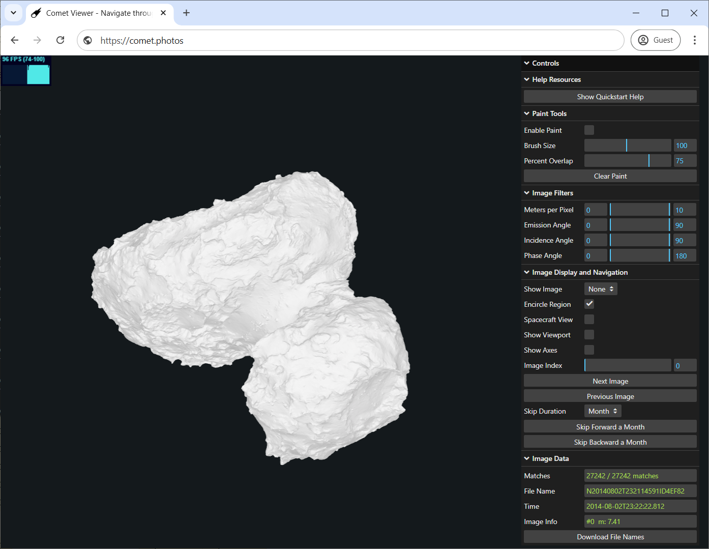
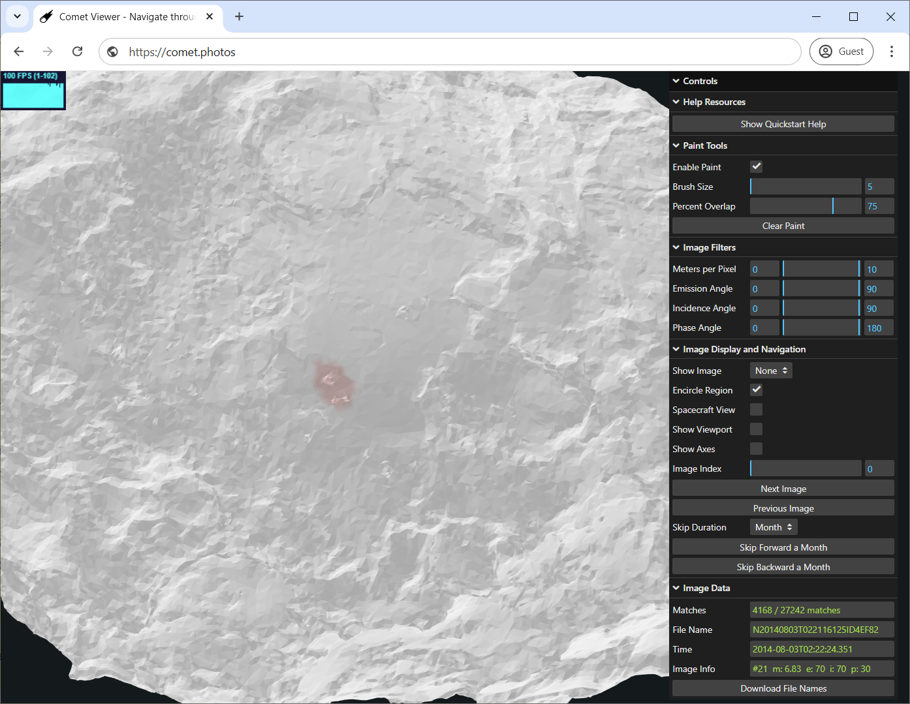
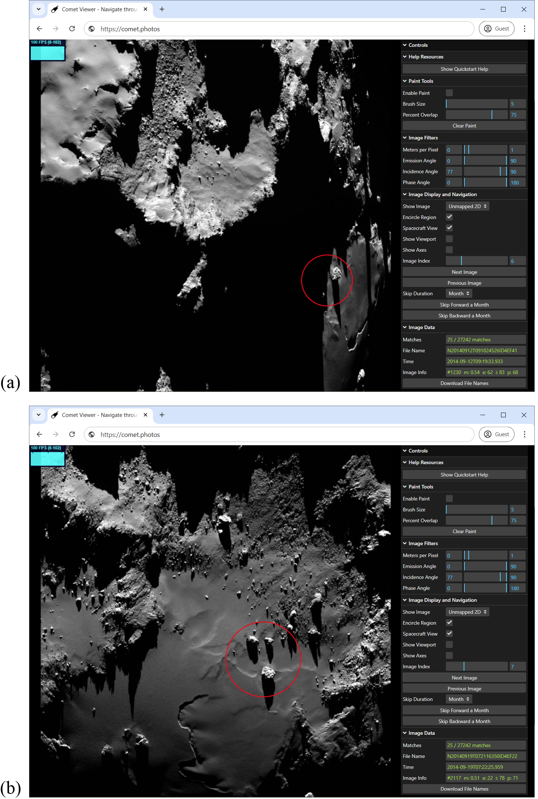
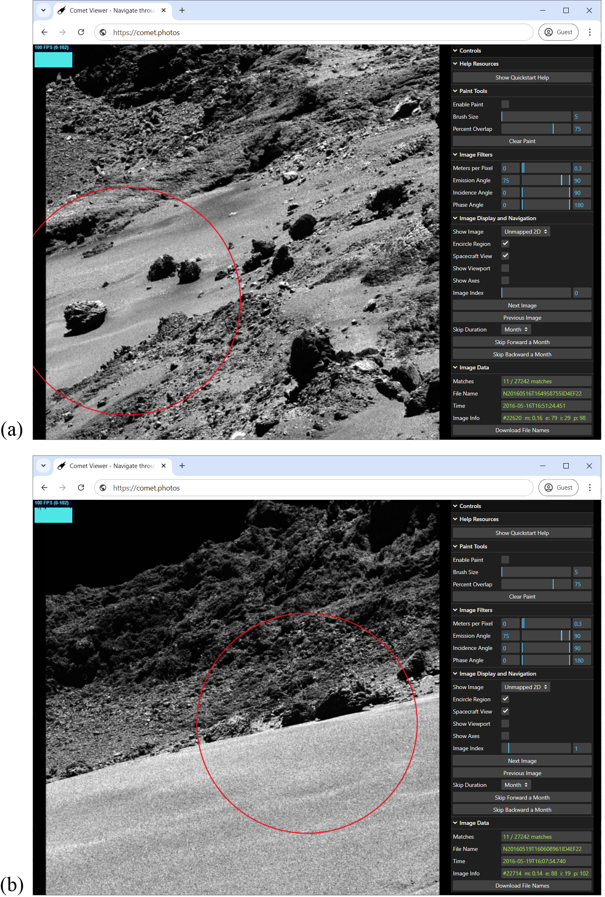
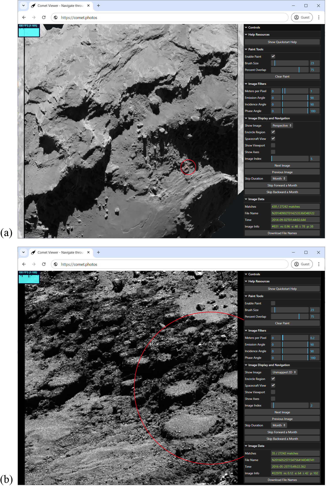

# Comet.Photos

Comet.Photos allows for fast spatial search of images from the Rosetta comet mission, specifically images from Osiris' Narrow Angle Camera, which provide the most detailed images of Comet 67P. Users of Comet.Photos can paint a region of interest on a 3D model of the comet, optionally specifying various lighting / geometry parameters, and in a fraction of a second, all matching images are found and made available for browsing, either projected onto the comet 3D shape model, or in their original 2D form.

There are two different usage options for Comet.Photos. People who expect to make frequent use of the software for their research are encouraged to install the program locally on their computer for best performance, with seemingly instantaneous feedback. However, people casually interested in trying out Comet.Photos can access the latest version at https://comet.photos to take it out for a spin. 

## Table of contents

* [Installation](#installion)
* [Motivation](#motivation)
* [User Manual](#user-manual)
* [Step-by-Step Example](#step-by-step-example)
* [Architecture](#architecture)
* [Performance](#performance)
* [Acknowledgments](#acknowledgments)
* [How to Report Issues](#how-to-report-issues)

## Installation

People wanting to try out Comet.Photos can simply run it in a web browser by visiting https://comet.photos. However, we suggest that scientists who expect to make frequent use of Comet.Photos should install it locally on their computer (Windows, Mac, or Linux) for the fastest, best experience. Installing Comet.Photos locally does require about 14GB of disk space (and an addition 14GB during the install process, which is freed up afterwards), mostly for the comet image files, but when the image files are local, it feels like all operations are instantaneous.

There are two ways to install Comet.Photos locally: from a tar archive, or from github. Installing from the tar archive is easiest, while installing from github may be preferable for people hoping to contribute to the project.

### Option 1: Installation from a tar file (easiest)

1. Install Node.js.

Node.js is a popular JavaScript runtime required by Comet.Photos, which can be downloaded from https://nodejs.org/. You can simply install the LTS version from the home page, and if prompted, there is no need to install any extras.

2. Download and unpack the Comet.Photos release

Download the packaged comet.photos runtime by clicking here: [comet-photos-v2.0.tar.gz](https://comet.photos/comet-photos-v2.0.tar.gz). This will start copying the file to your browser's download folder. However due to the quantity of photos, this may take some time, so be prepared. Get a cup of coffee, or get some sleep, depending on your Internet speed. When the download completes, move the file to the folder where you want the Comet.Photos directory to reside. Open up a terminal, shell, or cmd window, and navigate to the folder that holds Comet.Photos.tar. If you are on a mac, type: **xattr -d com.apple.quarantine comet-photos-v2.0.tar.gz** to allow your machine to trust the download.

If you haven't done so already, open up a terminal, shell, or cmd window, and navigate to the folder that holds .tar.gz file. Then, no matter what kind of computer you have, run the following command in the terminal to extract the files from the package:
**tar xzf comet-photos-v2.0.tar.gz**
This may take up to 10 minutes as there are plenty of files to unpack. After the tar command finishes up, Comet.Photos will be installed in the new Comet.Photos folder, and you can delete the .tar.gz file to free up space.

Congratulations! You have now installed Comet.Photos. Advance to the [Starting Comet.Photos](#starting-cometphotos) section to learn how to start up the app.

### Option 2: Installation from Github (more steps)

1. Install Node.js

Node.js is a popular JavaScript runtime required by Comet.Photos, which can be downloaded from https://nodejs.org/. You can simply install the LTS version from the home page, and if prompted, there is no need to install any extras.

2. Fetch the Comet.Photos release from Github.

Get a copy of the release from the Comet.Photos repository (Explanation here)

3. Extract the files from the .zip or .tar.gz

If you are installing from Github, we should know how to unpack the archive onto your local computer.

4. Install the dependencies.

Go into the top level folder (Comet.Photos), and type: **npm install**

5. Download and install the data folder contents

The dataset is too large to include in Github, so it needs to be downloaded and unpacked as an additional step. Download the packed data set by clicking here [comet-photos-data-v2.0.tar.gz](https://comet.photos/comet-photos-data-v2.0.tar.gz). Again, this is close to 14GB, so it may take some time. Don't fret - it will be worth it! Move this file to your Comet.Photos directory if it is not there already. Open up a terminal, shell, or cmd window, and navigate to the folder that holds this .tar.gz file. If you are on a mac, type: **xattr -d com.apple.quarantine comet-photos-data-v2.0.tar.gz** to allow your machine to trust the download.

If you haven't done so already, open up a terminal, shell, or cmd window, and navigate to the folder that holds .tar.gz file. Then, no matter what kind of computer you have, run the following command in the terminal to extract the files from the package:
**tar xzf comet-photos-data-v2.0.tar.gz**
This may take up to 10 minutes as there are plenty of files to unpack. After the tar command finishes up, Comet.Photos should be completely installed, and you can move on to the next step, [Starting Comet.Photos](#starting-cometphotos).

### Starting Comet.Photos

As mentioned before, you can always start a web-based session with Comet.Photos by simply navigating to https://comet.photos. However, if you have installed Comet.Photos locally, simply run one of these scripts from the Comet.Photos directory:

 * On Windows: **RUN_ME_ON_WINDOWS.cmd**
 * On macOS: **RUN_ME_ON_MAC.command**
 * On Linux: **RUN_ME_ON_LINUX.sh**

This should open up a browser on your machine and connect it to your own personal comet.photos server running locally. If you have any difficulties, email info@comet.photos, and we'll try to help.

## Motivation

The European Space Agency's (ESA) Rosetta mission to Comet
67P/Churyumov-Gerasimenko (hereafter, 67P) provided the most
comprehensive dataset for a comet to date. The OSIRIS Narrow Angle
Camera (NAC) returned an immense corpus of the most detailed
high-resolution images, providing unprecedented spatial and temporal
coverage of a cometary surface (Keller et al., 2007). This extensive
dataset enables a diverse range of analyses for regions of interest on
the comet. Multiple images of the same area can be leveraged for
photometric studies (Oklay et al., 2015; Fornasier et al., 2023), used
to derive estimates of the local topography through techniques like
photoclinometry (Jindal et al., 2024), or examined over time to track
surface evolution and understand how cometary landscapes change
(Barrington et al., 2023; Jindal et al., 2022; Birch et al., 2019;
El‐Maarry et al., 2017; Fornasier et al., 2017; Keller et al., 2017; O.
Groussin et al., 2015). However, as noted by Barrington et al. (2023),
identifying relevant images for such analyses is a highly challenging
and time-consuming task, requiring a manual search through ESA's
Planetary Science Archive (PSA). This difficulty is further compounded
by Rosetta's variable orbit around 67P, which often results in images of
the same region appearing vastly different from one another. Efforts
have been made to mitigate these challenges---for example, ESA has
introduced an image search capability within the PSA. However, this tool
remains inadequate (at least for Rosetta), as it (a) is still slow, (b)
frequently returns incorrect data, and (c) lacks user control over
filtering searches by image parameters, a crucial feature for assembling
a manageable dataset without wasting time removing irrelevant images.
Hence, to fully harness the scientific potential of Rosetta's vast
dataset and empower researchers to quickly and accurately identify
relevant observations for analysis, an efficient and intuitive tool is
needed to streamline image retrieval.

Comet.Photos has been developed to fill this
critical gap, providing a powerful solution for spatially targeted image
searches and facilitating detailed studies of cometary surface
evolution. Users can define a region of interest by interactively
selecting the desired region on a 3D model of 67P. In a fraction of a
second, the application searches through over 27,000 NAC images to find
only those that feature the selected region. In addition to this spatial
search filter, Comet.Photos also allows users to filter images based on
their resolution and viewing geometry. To search only images with a fine
spatial resolution, users can filter by the *image resolution*, which
represents the linear scale of a pixel on the surface. Three other
parameters of interest from a photometric and surface standpoint are the
*emission angle* (the angle between the camera and surface normal),
*incidence angle* (the angle between the Sun and the surface normal),
and *phase angle* (the solid angle between the Sun and camera at the
surface). All three of these can be filtered as well. Images matching
the search criteria can be displayed in the application, either in their
original 2D form or projected onto the 3D model. At the end of a session
with Comet.Photos, a list containing the IDs of the filtered images can
also be downloaded, allowing further analysis with external tools.

Comet.Photos has been architected so that it can run on the web, requiring
no software download or installation, or it can be installed and run on a local
computer for the fastest interaction speeds. One of our key goals has been to
broaden access to Rosetta's dataset, making it available to people
regardless of their computing resources or prior experience in planetary
science. After rigorous internal testing, we are now making this tool
available to the broader scientific community, educators, and anyone in
the public interested in exploring the surface of comet 67P.

## User Manual

Using Comet.photos, you can manipulate a 3D model of Comet 67P, paint a region of interest, and quickly retrieve all images taken of that region. You can further filter down the image set by specifying other image parameters, and at any time you can navigate through all of the matching images, and display them in either two dimensions or texture-mapped onto the 3D comet model. This is done in 4 easy steps.

### Step 1: Finding the Region of Interest
Figure 1 shows the window upon starting up Comet.Photos. A 3D shape model of 67P appears on the left, and a control panel appears on the right. 

  
  

  <em>Figure 1. Comet.Photos user-interface. On the left side is a 3D shape model of 67P that can be rotated and scaled with a mouse or touch, and on the right is a panel of controls that help set up an image search.</em>

 

The shape
model can be rotated or scaled about a point in its interior. Moving the
mouse with the left button pressed (or dragging a finger on a touch
device) rotates the shape model. The mouse's scroll wheel (or the common
two-fingered pinching gesture on touch devices) zooms in or out of the
shape model for greater detail or more context. The right mouse button
supports interactively choosing a new center of rotation, and the 3D
model can be translated parallel to the screen by using
shift-right-click, or a three fingered panning gesture on touch devices.

### Step 2: Painting the Region of Interest

For a typical research project, the first step is to specify a region of
interest on the shape model for the image search. This is done by
interactively 'painting' the relevant region of the comet, using the
mouse and the **Paint Tools** pane of the control panel (see Figure 1).
After rotating and scaling the shape model to make the region of
interest visible, the user enters 'paint' mode by selecting the **Enable
Paint** checkbox. The brush appears at the cursor when positioned over
the shape model, and this can be made bigger or smaller in paint mode by
using the scroll wheel, or choosing a specific brush radius (in meters)
using the **Brush Size** slider. While in paint mode, drawing with the
left mouse button down (or touching the shape model with a touch
display) will paint on the shape model. The right mouse button will use
the brush to erase part of a previously painted region. A **Percent
Overlap** slider allows the user to specify that images must contain at
least the given percentage (from 1% to 100%) of the painted region to be
considered a match. The **Clear Paint** button erases all the paint,
allowing the region selection to begin anew.  After every paint stroke, the **Matches** text field updates to show how many of the images match the filter. To exit paint mode, deselect the Enable Paint checkbox. At any time, you can go back to paint mode to adjust the region of interest.

### Step 3: Setting Other Image Filters

Painting on the shape model automatically filters the images by spatial
location, but the **Image Filters** pane allows filtering on additional
properties relating to the viewing geometries (Figure 1). For example,
the **Meters per Pixel** property specifies that searches should only
return images within a specified range of image resolutions. The
**Emission Angle** slider restricts matches to include only those images
in which the angle between the surface normal and the vector towards the
camera from the surface match the specified range. At 0^o^ the vector to
the camera is normal to the surface, while at 90^o^ the camera is at a
glancing angle to the surface. The **Incidence Angle** slider specifies
the minimum and maximum angles (in degrees) that the Sun must make
relative to the surface normal for a match to occur. At 0^o^ the Sun is
perfectly overhead, and at 90^o^ the Sun is at a glancing angle to the
surface. The **Phase Angle** slider constrains the search to include
only those images in which the angle between the sun, the spacecraft,
and the surface normal falls within the specified range. Note that the
values for meters per pixel, emission angle, incidence angle, and phase
angle can vary for every pixel in the image, however the user is
typically interested in these values within the selected region of
interest. So for these calculations, we use the average surface position
and surface normal over this region of interest.

### Step 4: Navigating through the Images

The next pane of the interface controls **Image Display and Navigation**
(Figure 1). Initially, the **Show Image** selector is set to *None*.
However, at any time it can be changed to *Unmapped 2D* to display the
current image as originally taken, or projected onto the comet by
setting the selector to *Perspective* (for a perspective projection) or
*Orthographic* (for an orthographic projection). Given the shifting
camera and comet positions, it can be difficult to visually locate the
region of interest even in an image that is known to contain it. To
address this, we added the **Encircle Region** checkbox, which places a
red circle around the region of interest. Projected images, when viewed
from an arbitrary perspective, may appear to have some distortions
because of the viewing angle. To remove those distortions, the user can
select **Spacecraft View** to see the image projection viewed as if from
the spacecraft camera's location at the time it was taken. The **Show
Viewport** checkbox places a blue outline in the plane perpendicular to
the camera's view, showing the extent of the image. The **Show Axes**
command displays the *x*, *y*, and *z* axes (red, green, and blue
respectively) in the comet's standard body-fixed coordinate system
(67P/C-G_CK). The next control is the **Image Index** slider, which
allows the user to scan through all of the images matching the current
search. It has an integer field to the right that shows the current
image index in the search, and images are sorted ascendingly by the time
they were taken. The **Next Image** button advances to the next image
that matches the filters, and the **Previous Image** button displays the
previous match. Since images taken close together in time often appear
similar, we provide an option to skip forward or backward in time. The
**Skip Duration** control specifies how much time should be skipped
(day, month, or year), and the **Skip Forward** and **Skip Backward**
buttons advance or revert to the next match at least the specified
duration from the current match.

Throughout the process of selecting a region of interest or adjusting
the non-geometric image filters, information on the current match
appears in the **Image Data** pane (Figure 1). The **Matches** field
shows how many images match the current search specification. 
The **File Name** field displays the name of the current image (the stem of the ESA
image filename), and the **Time** field shows when that image was taken
(the Coordinated Universal Time -- UTC -- in ISO 8061 format). The
**Image Info** field displays the index of the image (sorted by time) in
the entire data set. If no region is selected, it also shows the meters
per pixel (m) for the image. If a region is selected, it will show an
average meters per pixel (m) of the selected region, as well as the
average emission (e), incidence (i), and phase (p) angles for the
selected region for the current image. At any time, the list of matching
images can be downloaded with the **Download File Names** button, which
can be helpful for further analysis with the USGS ISIS Tools (USGS
2023).

## Step-by-Step Example

After loading the initial web page, we use the left mouse button to
rotate the comet, and the scroll wheel to zoom in on a region with a
cluster of three boulders which are visible in the 3D shape model and
merit further examination (Figure 2). We select the **Enable Paint**
checkbox, adjust the brush size, and paint the three boulders.

  
  

  <em>Figure 2. Painting an area of interest. With the <b>Enable Paint</b> checkbox set, we paint a region of the comet in which three large boulders are visible in the shape model.</em>

 

Immediately upon painting the region, a search is performed, and the
**Matches** field updates to show us that 4,168 images were found,
containing at least 75% of the painted region (as specified in the
**Percent Overlap** control). That is still a lot of images, and the
vast majority were taken far enough away from 67P, such that they
display little detail of our region of interest. Therefore, we adjust
the **Meters Per Pixel** slider so that only images with a fine enough
resolution to identify surface changes, representing one meter per pixel
or less, will be retrieved. This reduces the number of matches to 585.
We then set the **Show Image** control to *Perspective*, to map the
first image onto the shape model via a perspective transformation
(Figure 3a). Because **Encircle Region** is selected by default, a red
circle shows the location of the three boulders. We click **Next Image**
repeatedly to then see additional image matches projected onto the shape
model (Figure 3b).

  
  

  <em>Figure 3. Two different images projected onto the shape model, showing the region of interest circled in red. Looking at the <b>Time</b> field, we see these were taken in (a) late August and (b) early September of 2014.</em>

 

Note that both of these projections appear to have bands or gaps in
them. This is because we are viewing them from a different vantage point
than what was acquired by Rosetta, where there is either an imperfect
match between shape model facets and image pixels and/or because various
facets were hidden from view at the time of acquisition. To view the
current image (e.g., Figure 3b) from Rosetta's perspective (position,
camera direction and camera up-vector) at the time the image was taken,
we check the **Spacecraft View** setting (Figure 4a). Although this
image is projected onto the shape model, it still appears very similar
to the original image, with any minor variations due to the underlying
shape model. We can also compare the two images by switching the **Show
Image** control to *Unmapped 2D*, displaying the original images (Figure
4b). Although these images are indeed very similar, projecting a 2D
image in 3D can add rendering artifacts, so often the *Unmapped 2D*
image presents the best view.

  
  

  <em>Figure 4. Views of the region of interest from Rosetta. (a) An image projected onto the 3D shape model. (b) The original 2D image.</em>

 

Initially we want to view images with shadows, because shadows can
accentuate surface detail. We set the **Incidence Angle** to be
77^o^-90^o^, restricting our results to only those images with the Sun
at an extreme angle to the surface. Immediately the results are updated,
and we see there are 25 such images of the region of interest, (Figure
5). Examining the **Image Info** field of the image retrieved in Figure
5a, we see that the incidence angle is 83^o^. With the Sun so low on the
horizon, two of the boulders are hidden in shadow from the ridge above,
yet the red circle helps us identify the one visible boulder that
remains within our region of interest. We advance to the next image of
the resulting subset, (Figure 5b) another heavily shadowed image, which
has an incidence of 78^o^ at the region of interest.

  
  

  <em>Figure 5. Two images of the region of interest with high angle of incidence, and hence heavily shadowed. (a) Image with an incidence angle of 83&deg, partially shadowed by a nearby ridge; (b) Image with incidence angle of 78&deg.</em>

 

Next, we decide to see the best close-up images of these three boulders
in profile. We restore the **Incidence Angle** filter to the original
setting of 0^o^-90^o^, because we no longer care about shadows, set the
**Meters Per Pixel** slider to 0-0.3 m, and set the **Emission Angle**
to 75^o^-90^o^. There are 11 matches. Again, the red circle helps us
identify the relevant boulders of our region of interest because there
are other boulders of similar sizes nearby (Figure 6).

  
  

  <em>Figure 6. Two close-up images of the boulders in profile. (a) Image with a sample resolution of 0.16 meters2/pixel and emission angle of 78&deg; (b) Image with a sample resolution
  of 0.14 meters2/pixel and emission angle of 88&deg.</em>

 

We began this session by painting three boulders that were visible in
the 3D shape model; however, it is also important to be able to search
for features not discernable in the shape model alone. Comet.Photos
supports a process of iterative refinement, where a new region of
interest can be painted on a previously retrieved image, setting up a
new search. This step can be repeated as necessary to converge on a
known feature or serendipitously explore new ones. For example, earlier
in Figure 4a, we retrieved an image of three boulders. Upon closer
examination, we see two very small circular features in that image that
we would like to explore in greater detail. The current version of the
application only supports painting on an image that is projected in
*Perspective* mode, so we ensure that this mode is chosen. We then
select the **Enable Paint** checkbox, and then click **Clear Paint** to
erase the previous region of interest. Next, we paint the two small
circular features (Figure 7a). This matches 430 images with the **Meters
Per Pixel** slider set to 0-1.0. We adjust this slider to 0-0.2 to
retrieve only the images taken closest to the region of interest,
resulting in 35 image matches. For the best image quality, we set **Show
Image** to *Unmapped 2D*. One of the matches, reveals that the two
craters are actually part of a large cluster of similar features (Figure
7b).

  
  

  <em>Figure 7. Specifying a new search by iterative refinement. (a) A boulder image from an earlier search (Figure 4a) with a crater detail painted as the new area of interest; (b) A close-up image match revealing additional craters.</em>

 

## Architecture

Architecture discussion goes here

## Performance 

Performance goes here

## Acknowledgments

Acknowledgments go here.

## How to Report Issues

This is how to report issues...

[Comet.Photos website]: https://comet.photos/
