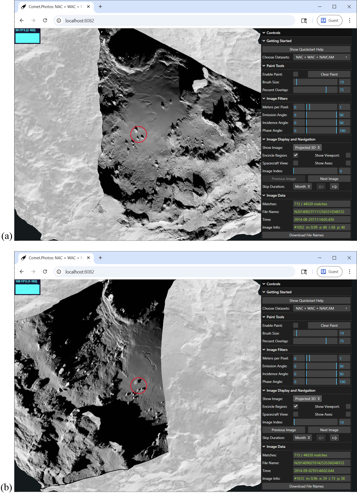
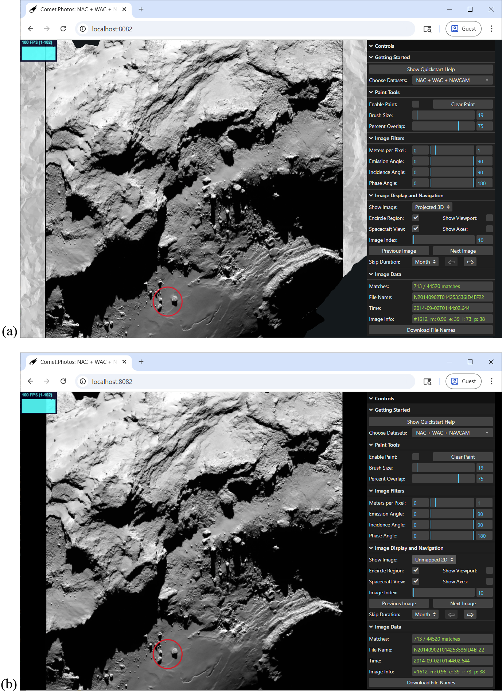
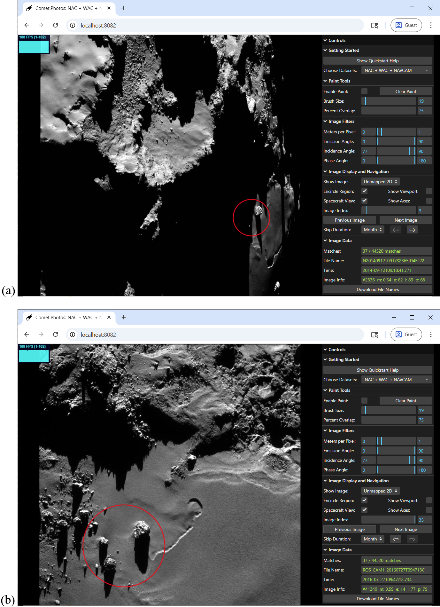
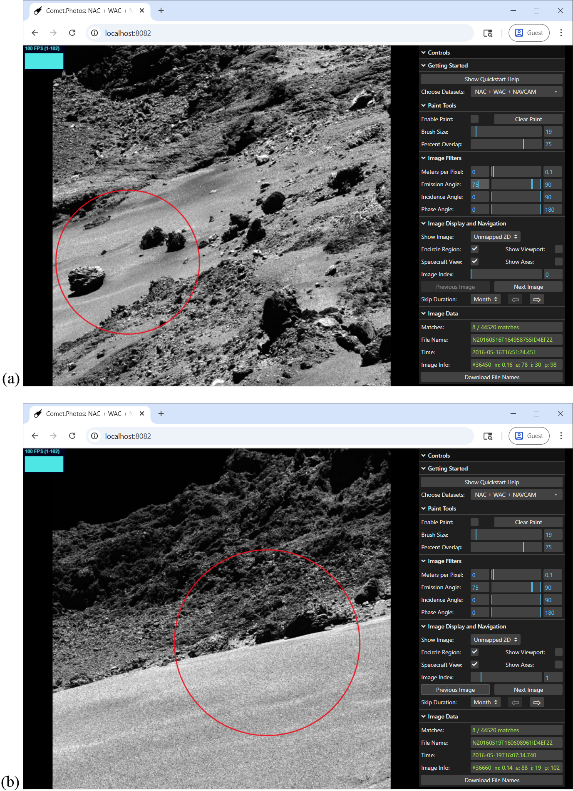
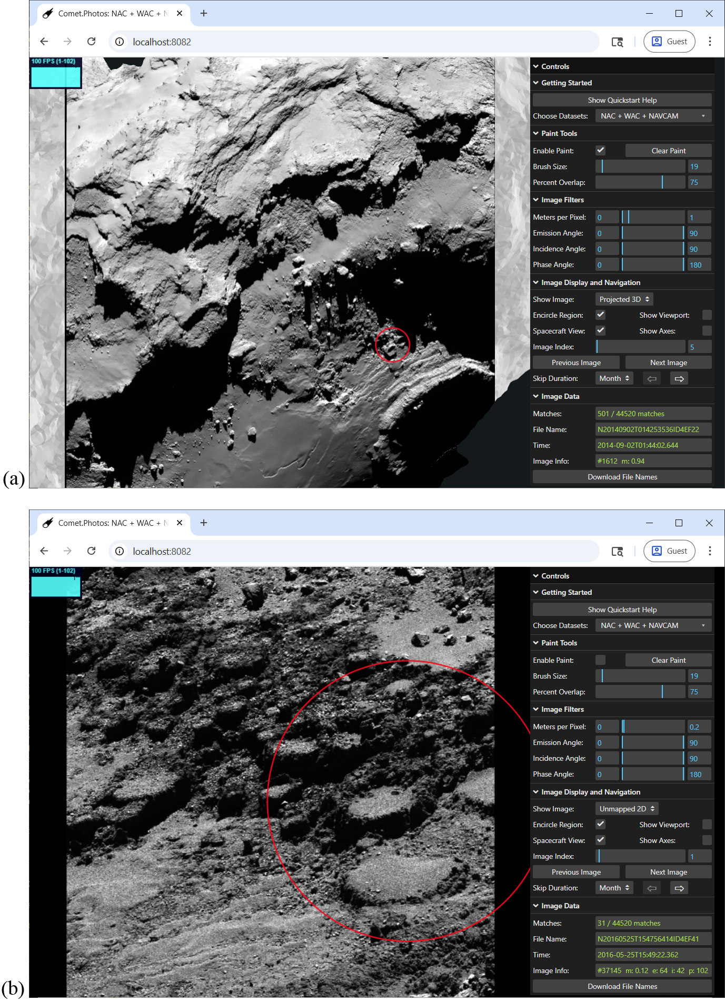

# Comet.Photos

Comet.Photos allows for fast spatial search of images from the Rosetta comet mission, including images from Osiris' Narrow Angle Camera, Wide Angle Camera, as well as the NavCam. Users of Comet.Photos can paint a region of interest on a 3D model of the comet, optionally specifying various lighting / geometry parameters. In a fraction of a second, all matching images are found and made available for browsing, either projected onto the comet 3D shape model, or in their original 2D form.

There are two different usage options for Comet.Photos. People who expect to make frequent use of the software for their research are encouraged to install the program locally on their computer for best performance, with seemingly instantaneous feedback. However, people casually interested in trying out Comet.Photos can access the latest version at https://comet.photos to take it out for a spin without installing any software. 

## Table of Contents

* [Installation](#installation)
* [Testing the Installation](#testing-the-installation)
* [Motivation](#motivation)
* [User Manual](#user-manual)
* [Step-by-Step Example](#step-by-step-example)
* [Design, Architecture, and Implementation](#design-architecture-and-implementation)
  * [The Data Files](#the-data-files)
  * [An Architectural Walkthrough](#an-architectural-walkthrough)
  * [Software Engineering Notes](#software-engineering-notes)
* [Performance](#performance)
* [Acknowledgments](#acknowledgments)
* [References](#references)
* [How to Report Issues](#how-to-report-issues)
* [How to Help Out](#how-to-help-out)
* [Credits](#credits)

## Installation

Scientists who expect to make frequent use of Comet.Photos should install it locally on their computer (Windows, Mac, or Linux) for the fastest, best user experience. Installing Comet.Photos locally requires about 12.5GB of disk space (and an additional 12.5GB during the install process, which is freed up afterwards). 

There are two ways to install Comet.Photos locally: from a tar archive (option 1), or from GitHub (option 2). Installing from the tar archive is easiest and is highly recommended, while installing from GitHub may be preferable for people hoping to contribute to the project.

### Option 1: Installation from a tar file (easiest)

1. Install Node.js.

Node.js is a popular JavaScript runtime required by Comet.Photos, which can be downloaded from https://nodejs.org/. You can simply install the LTS version from the home page, and if prompted, there is no need to install any extras.

2. Download and unpack the Comet.Photos release

Download the packaged Comet.Photos release by clicking here: [comet-photos-v3.0.tar.gz](https://comet.photos/comet-photos-v3.0.tar.gz). This will start copying the file to your browser's download folder. However due to the quantity of photos, this may take some time, so be prepared. Get a cup of coffee, or get some sleep, depending on your Internet speed. When the download completes, move the file to the folder where you want the
Comet.Photos directory to reside. Open up a terminal, shell, or cmd window, and navigate to the folder that holds .tar.gz file. If you are on a mac, type: **xattr -d com.apple.quarantine comet-photos-v3.0.tar.gz** to allow your machine to trust the download.

Run the following command in the terminal to extract the files from the package:
**tar -xf comet-photos-v3.0.tar.gz**
This may take up to 10 minutes as there are plenty of files to unpack. After the tar command finishes up, Comet.Photos will be installed in the new Comet.Photos folder, and you can delete the .tar.gz file to free up space.

Congratulations! You have now installed Comet.Photos. Advance to the [Starting Comet.Photos](#starting-cometphotos) section to learn how to start up the app.

### Option 2: Installation from GitHub (more steps)

Option 2 is intended for developers who plan to modify or contribute to the project, and know how to use git. In this option, the source code is installed from GitHub, but the data files are installed from a .tar.gz archive (because the data is too large to store in GitHub). 

1. Install Node.js

Node.js is a popular JavaScript runtime required by Comet.Photos, which can be downloaded from https://nodejs.org/. You can simply install the LTS version from the home page, and if prompted, there is no need to install any extras.

2. Fetch the Comet.Photos release from GitHub.

Install the git package if you haven't already. Get a copy of the files locally via **git clone https://github.com/comet-dot-photos/comet-dot-photos**. If you are on a mac, cd to the Comet.Photos directory in a terminal window, and run **xattr -r -d com.apple.quarantine ./** which will remove Apple's quarantine bit on all the files in the tree.

3. Install the dependencies and build the project.

Go into the top level folder (Comet.Photos), and type: **npm install** which will install the node_modules for all package dependencies in both the client/ and server/ subdirectories. Then type **npm run build** to build the project.

4. Download and install the dataset into the /data subdirectory.

The dataset is too large to include in GitHub, so it needs to be downloaded and unpacked as an additional step. Download the dataset by clicking here [comet-photos-data-v3.tar.gz](https://comet.photos/comet-photos-data-v3.tar.gz), which will start downloading the dataset into the browser's download folder. Again, this is a little over 12.3 GB, so it may take some time. Don't fret - it will be worth it! When the transfer completes, move this file to your Comet.Photos directory. Run this tar command on the dataset to unpack it and create a data subdirectory under Comet.Photos:
**tar -xf comet-photos-data-v3.tar.gz**
This may take up to 10 minutes as there are plenty of files to unpack. After the tar command finishes up, Comet.Photos should be completely installed. You can delete the original tar file, and can move on to the next step, [Starting Comet.Photos](#starting-cometphotos).

### Starting Comet.Photos

After you have installed Comet.Photos locally, simply run one of these scripts from the Comet.Photos directory:

 * On Windows: **RUN_ME_ON_WINDOWS.cmd**
 * On macOS: **RUN_ME_ON_MAC.command**
 * On Linux: **RUN_ME_ON_LINUX.sh**

This should open up a browser on your machine and connect it to your own personal Comet.Photos server running locally.

### Testing the Installation

When the program is installed correctly, invoking the appropriate **RUN_ME** specified above will open up a browser window (or a new tab in an existing browser window) to http://localhost:8082, and load a 3D model of 67P. The **Matches** field in the control panel should report "44520/44520 matches", indicating that initially every image is loaded, and none are filtered out. On startup, the program checks key parts of its installation, and prints out messages to convey its state. If an error occurs, this output often points to a missed step in the installation, or a configuration inconsistency. Please report any problems (see [How to Report Issues](#how-to-report-issues)), and include this output. People wanting to further test the installation can follow along with the [Step-By-Step Example](#step-by-step-example) on their own computer, although expect small differences based on variations in the precise region of interest that is painted. 

Those wanting to test the installation more completely can run a regression test, including over 5,000 filtering operations. To do so, type Ctrl-Shift-~ and a debug menu will appear at the bottom of the control panel (you may need to scroll to see it). Press one of the "Run Log" buttons (with this example, fastest = < 1 minutes, fast = < 5 minutes, timed = < 10 minutes. They all test equally, but vary by how much changing state to visually show during the test.). Enter "regression1" in the dialog that pops up. This will test visibility operations, and all of the geometric image filters. Do not adjust the controls until you are notified that the regression test has completed. To hide the debug menu, type Ctrl-Shift-~ again. 

## Motivation

The European Space Agency's (ESA) Rosetta mission to Comet
67P/Churyumov-Gerasimenko (hereafter, 67P) provided the most
comprehensive dataset for a comet to date. The OSIRIS (Keller et al., 2007)
Narrow Angle Camera (NAC), Wide Angle Camera (WAC), and Navigation Camera (NavCam)
returned an immense corpus of detailed
high-resolution images, providing unprecedented spatial and temporal
coverage of a cometary surface. This extensive
dataset enables a diverse range of analyses for regions of interest on
the comet. Multiple images of the same area can be leveraged for
photometric studies (Oklay et al., 2015; Fornasier et al., 2023), used
to derive estimates of the local topography through techniques like
photoclinometry (Jindal et al., 2024), or examined over time to track
surface evolution and understand how cometary landscapes change
(Barrington et al., 2023; Jindal et al., 2022; Birch et al., 2019;
El‐Maarry et al., 2017; Fornasier et al., 2017; Keller et al., 2017; Groussin et al., 2015). However, as noted by Barrington et al. (2023),
identifying relevant images for such analyses is a highly challenging
and time-consuming task, requiring a manual search through ESA's
Planetary Science Archive (PSA). This difficulty is further compounded
by Rosetta's variable orbit around 67P, which often results in images of
the same region appearing vastly different from one another. Efforts
have been made to mitigate these challenges---for example, ESA has
introduced an image search capability within the PSA. However, this tool
remains inadequate (at least for Rosetta), as it (a) is still slow, (b)
frequently returns incorrect data, and (c) lacks user control over
filtering searches by image parameters, a crucial feature for assembling
a manageable dataset without wasting time removing irrelevant images.
Hence, to fully harness the scientific potential of Rosetta's vast
dataset and empower researchers to quickly and accurately identify
relevant observations for analysis, an efficient and intuitive tool is
needed to streamline image retrieval.

Comet.Photos has been developed to fill this
critical gap, providing a powerful solution for spatially targeted image
searches and facilitating detailed studies of cometary surface
evolution (Kurlander, 2025). Users can define a region of interest by interactively
selecting the desired region on a 3D model of 67P. In a fraction of a
second, the application searches through over 44,000 NAC, WAC, and NavCam images to find
only those that feature the selected region. In addition to this spatial
search filter, Comet.Photos also allows users to filter images based on
their pixel scale and viewing geometry. To search only images with a fine
pixel scale, users can filter by *meters per pixel*, which
represents the linear scale of a pixel on the surface. Three other
parameters of interest from a photometric and surface standpoint are the
*emission angle* (the angle between the camera and surface normal),
*incidence angle* (the angle between the Sun and surface normal),
and *phase angle* (the solid angle between the Sun and camera at the
surface). All three of these can be filtered as well. Images matching
the search criteria can be displayed in the application, either in their
original 2D form or projected onto the 3D model. At the end of a session
with Comet.Photos, a list containing the IDs of the filtered images can
also be downloaded, allowing further analysis with external tools.

Comet.Photos has been architected so that it can run on the web, requiring
no software download or installation, or it can be installed and run on a local
computer for the fastest interaction speeds. One of our key goals has been to
broaden access to Rosetta's dataset, making it available to people
regardless of their computing resources or prior experience in planetary
science. After rigorous internal testing, we are now making this tool
available to the broader scientific community, educators, and anyone 
interested in exploring the surface of comet 67P.

## User Manual

  

  <em>Figure 1. Comet.Photos user-interface. On the left side is a 3D shape model of 67P that can be rotated and scaled with a mouse or touch, and on the right is a panel of controls that help set up an image search.</em>

 

Upon starting up Comet.Photos, the window in [Figure 1](#fig1) appears, with a 3D shape model of 67P on the left, and a control panel on the right. Using Comet.Photos, you can manipulate the 3D comet model, paint a region of interest, and quickly retrieve all images taken of that region. You can further filter down the image set by specifying other image parameters, and at any time you can navigate through all of the matching images, and display them in either two dimensions or texture-mapped onto the 3D comet model. This is done in 5 easy steps.

### Step 1: Selecting the Datasets

Comet.Photos can search for images taken by any of the three conventional cameras onboard Rosetta. By default, searches include the Narrow Angle Camera (NAC), Wide Angle Camera (WAC), and Navigation Camera (NAVCAM). Using the **Choose Datasets** menu in the control panel, users can restrict the search to one or more datasets.

### Step 2: Finding the Region of Interest

The shape
model can be rotated or scaled about a point in its interior. Moving the
mouse with the left button pressed (or dragging a finger on a touch
device) rotates the shape model. The mouse's scroll wheel (or the common
two-fingered pinching gesture on touch devices) zooms in or out of the
shape model for greater detail or more context. The right mouse button
supports interactively choosing a new center of rotation, and the 3D
model can be translated parallel to the screen by using
shift-right-click, or a three fingered panning gesture on touch devices. Double left-clicking will restore the center of rotation to its original position.

### Step 3: Painting the Region of Interest

For a typical research project, the first step is to specify a region of
interest on the shape model for the image search. This is done by
interactively 'painting' the relevant region of the comet, using the
mouse and the **Paint Tools** pane of the control panel (see [Figure 1](#fig1)).
After rotating and scaling the shape model to make the region of
interest visible, the user enters 'paint' mode by selecting the **Enable
Paint** checkbox. The brush appears at the cursor when positioned over
the shape model, and this can be made bigger or smaller in paint mode by
using the scroll wheel, or choosing a specific brush radius (in meters)
using the **Brush Size** slider. While in paint mode, drawing with the
left mouse button down (or touching the shape model with a touch
display) will paint on the shape model. The right mouse button will use
the brush to erase part of a previously painted region. A **Percent
Overlap** slider allows the user to specify that images must contain at
least the given percentage (from 1% to 100%) of the painted region to be
considered a match. The **Clear Paint** button erases all the paint,
allowing the region selection to begin anew.  After every paint stroke, the **Matches** text field updates to show how many of the images match the filter. To exit paint mode, deselect the **Enable Paint** checkbox. At any time, you can go back to paint mode to adjust the region of interest.

### Step 4: Setting Other Image Filters

Painting on the shape model automatically filters the images by spatial
location, but the **Image Filters** pane (see [Figure 1](#fig1)) allows filtering on additional
properties relating to the viewing geometries. For example,
the **Meters per Pixel** property specifies that searches should only
return images within a specified range of pixel scales. The
**Emission Angle** slider restricts matches to include only those images
in which the angle between the surface normal and the vector towards the
camera from the surface match the specified range. At 0° the vector to
the camera is normal to the surface, while at 90° the camera is at a
glancing angle to the surface. The **Incidence Angle** slider specifies
the minimum and maximum angles (in degrees) that the Sun must make
relative to the surface normal for a match to occur. At 0° the Sun is
perfectly overhead, and at 90° the Sun is at a glancing angle to the
surface. The **Phase Angle** slider constrains the search to include
only those images in which the angle between the sun, the spacecraft,
and the surface normal falls within the specified range. Note that the
values for meters per pixel, emission angle, incidence angle, and phase
angle can vary for every pixel in the image, however the user is
typically interested in these values within the selected region of
interest. So for these calculations, we use the average surface position
and surface normal over this region of interest.

### Step 5: Navigating through the Images

The next pane of the interface controls **Image Display and Navigation**
(see [Figure 1](#fig1)). Initially, the **Show Image** selector is set to *None*.
However, at any time it can be changed to *Unmapped 2D* to display the
current image as originally taken, or projected onto the comet by
setting the selector to *Projected 3D*. Given the shifting
camera and comet positions, it can be difficult to visually locate the
region of interest even in an image that is known to contain it. To
address this, we added the **Encircle Region** checkbox, which places a
red circle around the region of interest. Projected images, when viewed
from an arbitrary perspective, may appear to have some distortions
because of the viewing angle. To remove those distortions, the user can
select **Spacecraft View** to see the image projection viewed as if from
the spacecraft camera's location at the time it was taken. The **Show
Viewport** checkbox places a blue outline in the plane perpendicular to
the camera's view, showing the extent of the image. The **Show Axes**
command displays the *x*, *y*, and *z* axes (red, green, and blue
respectively) in the comet's standard body-fixed coordinate system
(67P/C-G_CK). The next control is the **Image Index** slider, which
allows the user to scan through all of the images matching the current
search. It has an integer field to the right that shows the current
image index in the search, and images are sorted ascendingly by the time
they were taken. The **Next Image** button advances to the next image
that matches the filters, and the **Previous Image** button displays the
previous match. Since images taken close together in time often appear
similar, we provide an option to skip forward or backward in time. The
**Skip Duration** control specifies how much time should be skipped
(day, month, or year), and the **⇨** and **⇦**
buttons advance or revert to the next match at least the specified
duration from the current match.

Throughout the process of selecting a region of interest or adjusting
the non-geometric image filters, information on the current match
appears in the **Image Data** pane (see [Figure 1](#fig1)). The **Matches** field
shows how many images match the current search specification. 
The **File Name** field displays the name of the current image (the stem of the ESA
image filename), and the **Time** field shows when that image was taken
(the Coordinated Universal Time -- UTC -- in ISO 8061 format). The
**Image Info** field displays the index of the image (sorted by time) in
the entire data set. If no region is selected, it also shows the meters
per pixel (m) for the image. If a region is selected, it will show an
average meters per pixel (m) of the selected region, as well as the
average emission (e), incidence (i), and phase (p) angles for the
selected region for the current image. At any time, the list of matching
images can be downloaded with the **Download File Names** button, which
can be helpful for further analysis with the USGS ISIS Tools (USGS,
2023).

## Step-by-Step Example

After starting up Comet.Photos, we use the left mouse button to
rotate the comet, and the scroll wheel to zoom in on a region with a
cluster of three boulders which are visible in the 3D shape model and
merit further examination ([Figure 2](#fig2)). We select the **Enable Paint**
checkbox, adjust the brush size, and paint the three boulders.

  

  <em>Figure 2. Painting an area of interest. With the <b>Enable Paint</b> checkbox set, we paint a region of the comet in which three large boulders are visible in the shape model.</em>

 

Immediately upon painting the region, a search is performed, and the
**Matches** field updates to show us that 6,439 images were found,
containing at least 75% of the painted region (as specified in the
**Percent Overlap** control). That is still a lot of images, and the
vast majority were taken far enough away from 67P, such that they
display little detail of our region of interest. Therefore, we adjust
the **Meters Per Pixel** slider so that only images with a fine enough
resolution to identify surface changes, representing one meter per pixel
or less, will be retrieved. This reduces the number of matches to 713.
We then set the **Show Image** control to *Projected 3D*, to map the
first image onto the shape model via a perspective transformation
([Figure 3a](#fig3)). Because **Encircle Region** is selected by default, a red
circle shows the location of the three boulders. We click **Next Image**
repeatedly to then see additional image matches projected onto the shape
model. Each time, this increments **Image Index**. The match with an **Image Index** of 10 appears in [Figure 3b](#fig3).

  

  <em>Figure 3. Two different images projected onto the shape model, showing the region of interest circled in red. Looking at the <b>Time</b> field, we see these were taken in (a) late August and (b) early September of 2014.</em>

 

Note that both of these projections appear to have bands or gaps in
them. This is because we are viewing them from a different vantage point
than that of the camera when the image was taken by Rosetta, so parts of the surface that are visible to us were hidden from view when the image was taken. To view the
current image (e.g., [Figure 3b](#fig3)) from Rosetta's perspective (position,
camera direction and camera up-vector) at the time the image was taken,
we check the **Spacecraft View** setting ([Figure 4a](#fig4)). Although this
image is projected onto the shape model, it still appears very similar
to the original image, with any minor variations due to the underlying
shape model. To view the image in its original 2D form, we set the **Show Image** control to *Unmapped 2D* ([Figure 4b](#fig4)). Although these images are indeed very similar, projecting a 2D
image in 3D can add rendering artifacts, so often the *Unmapped 2D*
image presents the best view.

  

  <em>Figure 4. Views of the region of interest from the Rosetta camera's perspective (a) An image projected onto the 3D shape model. (b) The original 2D image. The two should appear similar, and in fact do.</em>

 

Initially we want to view images with shadows, because shadows can
accentuate surface detail. We set the **Incidence Angle** to be
77°-90°, restricting our results to only those images with the Sun
at an extreme angle to the surface. Immediately the results are updated,
and we see there are 37 such images of the region of interest ([Figure 5a](#fig5)). Examining the **Image Info** field of the image shown in this figure, we see that the incidence angle is 83°. With the Sun so low on the
horizon, two of the boulders are hidden in shadow from the ridge above,
yet the red circle helps us identify the one visible boulder that
remains within our region of interest. We advance through the images, and examine **Image Index* 35 ([Figure 5b](#fig5)). This heavily shadowed image, with an incidence of 77° was taken by the NavCam, rather than the NAC which took all of the other images shown thus far.

  

  <em>Figure 5. Two images of the region of interest with high angle of incidence, and hence heavily shadowed. (a) Image with an incidence angle of 83&deg, partially shadowed by a nearby ridge; (b) Image with incidence angle of 77&deg.</em>

 

Next, we decide to see the best close-up images of these three boulders
in profile. We restore the **Incidence Angle** filter to the original
setting of 0°-90°, because we no longer care about shadows, set the
**Meters Per Pixel** slider to 0-0.3 m²/pixel, and set the **Emission Angle**
to 75°-90°. There are 8 matches, the first of which is shown in [Figure 6a](#fig6). The red circle helps us
identify the relevant boulders of our region of interest because there
are other boulders of similar sizes nearby. We advance to the next image, wich is shown in ([Figure 6b](#fig6)). Here the boulders are in profile, nearly camouflaged against a precipice, and the red circle helps us locate them.

  

  <em>Figure 6. Two close-up images of the boulders in profile. (a) Image with a sample resolution of 0.16 meters/pixel and emission angle of 78&deg; (b) Image with a sample resolution
  of 0.14 meters/pixel and emission angle of 88&deg.</em>

 

We began this session by painting three boulders that were visible in
the 3D shape model; however, it is also important to be able to search
for features not discernable in the shape model alone. Comet.Photos
supports a process of iterative refinement, where a new region of
interest can be painted on a previously retrieved image, setting up a
new search. This step can be repeated as necessary to converge on a
known feature or serendipitously explore new ones. For example, earlier
in [Figure 4a](#fig4), we retrieved an image of three boulders. Upon closer
examination, we see two very small circular features in that image that
we would like to explore in greater detail. The current version of the
application only supports painting on an image that is projected in
*Projected 3D* mode, so we ensure that this mode is chosen. We then
select the **Enable Paint** checkbox, and then click **Clear Paint** to
erase the previous region of interest. Next, we paint the two small
circular features ([Figure 7a](#fig7)). This matches 501 images with the **Meters
Per Pixel** slider set to 0-1.0. We adjust this slider to 0-0.2 to
retrieve only the images taken closest to the region of interest,
resulting in 31 image matches. We set **Show
Image** to *Unmapped 2D*. One of the matches, reveals that the two
craters are actually part of a large cluster of similar features ([Figure 7b](#fig7)).

  

  <em>Figure 7. Specifying a new search by iterative refinement. (a) A boulder image from an earlier search (Figure 4a) with a crater detail painted as the new area of interest; (b) A close-up image match revealing additional craters.</em>

 

## Design, Architecture, and Implementation

The design and architecture of Comet.Photos were driven by the goals
that the program be intuitive and fast, as well as widely and easily accessible.
To make Comet.Photos intuitive and easy to use, we implemented image
search in the user interface as *dynamic queries*. According to
(Shneiderman, 1994), *"Dynamic queries let users 'fly through' databases
by adjusting widgets and viewing the animated results. In studies, users
reacted to this approach with an enthusiasm more commonly associated
with video games."* Adjustments to Comet.photo's search parameters,
through the manipulation of sliders and checkboxes, immediately update
the result set visually. Painting on a 3D shape model of the comet also
updates the search results in real time to include only those images
that feature the painted region.
We aimed to build a scientific tool that would be engaging, intuitive,
and even fun to use.

To make the program fast and responsive, we pre-computed much of the
information needed
to perform the image queries.  We essentially determine in advance which vertices of
our 3D model of 67P would have been visible in every single image, and store that
information in a large visibility table, reducing the calculations needed at run-time. We also pre-calculate other information for every image, such as the location of the Rosetta spacecraft, the camera's view direction and "up" vector, and store this in advance, so these calculations need not be done at query time. 
 

To make the program widely and easily accessible, we implemented a client-server application, which can be run entirely on a local computer, or remotely via the web. This is important
because having the image files locally allows for the fastest, smoothest user experience, 
which is important to frequent users, but
casual users might be reluctant to install a 12.5 GB download.
The client, running as a program in the browser, performs most of the operations,
including the graphics manipulation (taking advantage of the GPU), displaying the user
interface and responding to user interactions, paint operations,
filtering the dataset via properties such as incidence angle or
emission angle, performing the initial pass on determining spatial image matches, and requesting various data from the server. The server is responsible for only delivering data files and the final
step of visibility determination. This final step of visibility
determination uses the pre-computed visibility table described above, which is too large to
transport to the client (see [The Data Files](#the-data-files)). This client-server
model, using a browser for user-interaction and rendering, also made it easier to
support a cross-platform program (Windows, Macs, and Linux) with a consistent user experience,
further fulfilling our accessibility goals.

The code was designed to be portable, maintainable, and extensible for spatial searches of images from other planetary science missions.

### The Data Files

There are three core data files used by Comet.Photos. The first is a 3D
shape model of 67P. This shape model is the
stereo-photogrammetrically-derived SHAP7 shape model created at the
German Aerospace Center (DLR) (Preusker, 2017). The specific shape model
file that we use is the same one incorporated in the openly-available
shapeViewer program (Vincent 2018, 2021). The shape model has 100,002
vertices and 200,000 triangular facets. We chose this shape model
because it has enough detail to identify major features, but not so many
vertices and facets that the visibility computations would become
prohibitively slow or the model would become too slow to load, as both
increase linearly with the facet or vertex count. Importantly, we choose
to determine visibility of the vertices, not the facets, because there
are fewer vertices and these vertices are discrete points in the shape
model. Therefore, when the user paints the 3D shape model, we consider
which vertices are painted, not which facets. This makes visibility
calculations faster, without adversely affecting the user experience.

The second data file is the *image metadata*, which is an array of
dictionaries, with one dictionary for each image in the data set
containing information related to that image. The image metadata is
computed in a preprocessing step and includes information from three
sources. Data extracted from the original NAC, WAC, and NavCam .IMG file headers and filenames
include the image resolution, the time the image was taken, and the name
of the image. Metadata computed from the SPICE (Acton, 1996) kernels
associated with the Rosetta mission (ESA, 2022) include the
position of the spacecraft at the time of the image, the camera viewing
vector and "up" vector, and the position of the Sun. Finally, a third
type of metadata is computed by doing visibility calculations on the 3D
shape model using the spacecraft position and camera vectors calculated
in the previous step for every NAC, WAC, and NavCam image. For the portion of the comet
that we calculate to be visible to the spacecraft at the time the image
was taken, we store the axis-aligned bounding as well as the minimum and
maximum distances along the camera vector. All positions and vectors are
in the comet's fixed-body coordinate system, and the image metadata
array is ordered ascendingly according to the time each image was taken.

The third data file is the *visibility table*. This table includes rows,
one for every image in the data set. Each row is a bit field, with one
bit for every vertex on the 3D shape model. During a preprocessing step,
we simulate the viewing configuration of every image in the data by
creating a virtual scene with the 3D shape model and Rosetta's camera
configuration as represented in the image metadata. From the virtual
camera, we cast a ray to every vertex in the shape model to determine
whether it would be visible in an image taken by the simulated Rosetta
camera, and store this information, a single bit for every vertex set as
1 for visible and 0 for non-visible, as a row in the visibility table.
Later on, at runtime, to decide whether a painted region of
interest is visible in one of the images, we take a bitfield of all the
vertices in the shape model, with the painted vertices represented by
1's, and then AND this with the visibility bitfield for that image
stored in the visibility table. The number of 1-bits in the result is
the number of painted vertices which are visible in that image.
Logical operations such as AND are very fast, but we still would prefer
not to check the painted region of interest against every row in the
table. Therefore, during the preprocessing step of determining the
vertices that are visible for each image, we also compute a bounding box
of the visible vertices, and store this back into the image metadata for
each image, as mentioned above. The client does its own bounding box
tests before requesting a visibility test from the server. If the
bounding box of the painted vertices does not intersect the bounding box
of visible vertices for an image, as stored in the image metadata, then
that image does not contain any of the region of interest, and that
image is omitted from the set to query from the server.

In terms of data volumes, the 3D shape model is approximately 7 MB, and
the image metadata is approximately for the combined NAC, WAC, and NavCam datasets 25 MB. However, they are both
compressed by the server before they are transmitted to the client,
reducing them to less than a third of their original sizes. The
visibility table is much larger, at approximately 556 MB (combined for the 3 datasets), so
pragmatically it must remain on the server. In addition to the three
core data files, Comet.Photos hosts 12.3 GB of comet image files in JPG
format on the server. These images are individually retrieved and
displayed by the client while navigating through search results.

### An Architectural Walkthrough

In this section we describe how the client and server interact, and
process the data files in a session similar to the one described in
Section 2. The client runs as a program in the browser, and the server
handles web file requests as well visibility operations. When Comet.Photos is running on the web, the client and server are two different machines, but when running locally, the client and server reside on the same computer.

[Figure 8](#fig8) shows the interactions between the client and server. Upon
browsing to the server, the client receives a
small HTML file and a Javascript application ([Figure 8, #1](#fig8)). The application's
first step is to load the dataset catalog from the server ([Figure 8, #2](#fig8)).
This catalog specifies the names of the 3D shape model and 
image metadata files (one for each dataset) in JSON format. Having these names,
the client requests them in parallel from the server ([Figure 8, #3](#fig8) and [Figure 8, #4](#fig8)).
Then the client displays the 3D shape model using the Three.js
JavaScript library for 3D rendering (Cabello, 2023). Using a virtual
trackball control, the 3D shape model can be rotated about its center
with the left mouse button, and the camera can be moved nearer or
further from the comet via the scroll wheel. Touch and pen gestures are
also supported.

  

  <em>Figure 8. The flow of information in Comet.photo's client-server model.
Requests from the client are indicated by light grey dashed arrows and
these requests always precede the server's responses which appear as
dark solid arrows. In response to client requests, the server sends (1)
the initial HTML page and the JavaScript program, and (2) the dataset catalog
which describes the dataset files to be loaded. The client then loads
these datasets, including (3) the 3D shape model of 67P, and 
(4) for each dataset, the image metadata which contains information such as
spacecraft location and camera direction for each image. As the user paints
the comet, a query is sent to the server on every mouseup (5), and the server
returns, for each dataset, the indices of images that contain the painted region
of interest (ROI). Prior to displaying each image, (6) the client requests and receives from the server
the image of the comet in JPG form.
Steps 1-4 only happen at start-up. Step 5 is repeated whenever the
region of interest is updated. Step 6 is repeated whenever the user
requests to see a new image from the data set. In this diagram, there
are k datasets, each dataset has its own n images (a number that varies per dataset), and m vertices in the comet's shape model.</em>

 

The user can turn on paint mode, and paint the shape model using a 3D
spherical brush. To make painting smooth and interactive, even with a
large number of vertices, we use Johnson's bounding volume hierarchy
package (Johnson, 2023), which employs spatial partitioning to speed up
raycasting and other spatial queries. This library was also used to
speed up raycasting during the creation of the visibility table in the
preprocessing step (see [The Data Files](#the-data-files)). Our painting routines are adapted from
Johnson's "collectTriangles" example, modified to paint vertices rather
than triangles. To support this, we employ an indexed shape model of the
comet, in which the same vertex can being reused for multiple facets.
This shape model is imported with Three.js' OBJLoader2 extension (Salmen
2023). When the mouse button is released after painting, we identify
which vertices were selected to be part of the region of interest, as
well as the average position and surface normal of the painted vertices.
Since we are using an indexed shape model, Three.js automatically
pre-calculates a normal for each vertex by averaging the normals of the
connected facets, making this fast and easy.

A bounding box is calculated for the painted region, which is compared
against the bounding box in every image's metadata dictionary. If the
boxes do not intersect, that image cannot depict any of the region of
interest. This is a rapid way of ruling out many of the non-matches. For
those images that still might match, the client has the server do a more
extensive visibility check using the visibility table. As described
above, the server is sent an array indicating the images that still need
to be checked (for each dataset) as well as a bit array indicating the painted vertices.
This bit-array representing the region of interest and the visibility bit array of
each image that passed the bounding box test are AND'ed together on the
server (see [The Data Files](#the-data-files)) with the resulting bit field containing the number
of painted vertices that would be visible in that image's camera / comet
configuration. To further speed things up, the server, written in
JavaScript, loads optimized C code, using the Koffi foreign function
interface (Martignène, 2024) to more efficiently perform bit operations.
The AND'ing is done in 64-bit sized chunks which can be executed in a
single operation on modern architectures. The server sends an array back
to the client indicating which images passed the final visibility check
([Figure 8, #5](#fig8)). All requests are sent via http, except for [Figure 8, #2 and #5](#fig8) which are sent via Socket.IO (Rauch, 2024) to ensure that the server and client are both operating on the same datasets (in the case of #2) or
to accommodate the large non-web-standard data types transmitted (in the case of #5) .

Search results are generated in the following way. All of the image
filters represented by sliders in the control panel (**Meters per Pixel**,
 **Emission Angle**, **Incidence Angle**, and **Phase Angle**)
are the results of geometric/vector math on information contained in the
image metadata -- such as spacecraft camera location and Sun location --
combined with information from the painted region of interest (average
position and average surface normal). For example, when we filter on the
emission angle, for every image metadata, we test if the angle between
the average surface normal in the region of interest and the vector from
the average position in the region of interest to the spacecraft camera
falls within the range specified by the slider. The client stores a
'filter byte' for each image, with each bit indicating a specific filter
that has passed or failed on this image, 1 if it has failed, and 0 if it
has passed. After applying the filters, only those images whose filter
byte is 0 have passed all of the filters, and are included in the result
set. When a single filter changes, the others typically need not be
retested, since the image's current pass/fail state of every filter is
persisted independently in this byte. The one exception is that after
changes to the region of interest, the visibility and geometric filters
need to be re-run because the geometric filters use the average position
and surface normal of the painted region. Nevertheless, filter
operations are performed very quickly: as the user adjusts a slider, or
lifts the paintbrush from the 3D shape model, the result set updates in
real-time.

The results are ordered ascendingly by the time each image was taken, a
decision made to assist scientists studying how the comet's landscapes
change through time. The interface shows a single image match at a time,
referred to as the current match, and other matches can be viewed by using the **Image Index** slider, as
well as the **Next Image**/**Previous Image** and skip interval **⇨**/**⇦** buttons. These controls therefore allow the user to navigate
forward and backwards in time through the matches to watch how the
surface evolves. This has proven to be an exceptionally powerful
capability, as it rapidly allows for determination of any surface
activity. Whenever there is a current match, information about the match
is shown in the **Image Data** pane of the control panel. This
information includes the image's name, the time it was taken, the index
of the image in the complete data set, and if a region of interest has
been painted, the average meters per pixel, emission, incidence, and
phase angles for that region. When the **Show Image** control is set to
display an image, the client requests a JPG file for the current image
from the server ([Figure 8, #6](#fig8)). With **Show Image** set to
*Unmapped 2D* the original images is displayed in two-dimensions on an
overlay canvas.
However, when **Show Image** is set to
*Projected 3D*, we texture map the image onto the 3D
shape model at the appropriate location (using the camera information
stored in the image metadata to do so). To help draw
the user's eye to the region of interest, if **Encircle Region** is checked,
Comet.Photos will draw a circle around the region of interest, projected
onto the overlay canvas. The center of the circle is the previously
calculated average painted position transformed to screen pixel
coordinates. The radius of the circle is the maximum distance from the
center to all of the painted vertices after they have been transformed to screen pixel
coordinates.

## Software Engineering Notes

Following good software engineering practices, the Comet.Photos client is implemented
as a set of object-based modules (Filter Engine, 3D Scene Manager, Image Browser, GUI Controller, etc...)
that communicate via events. The user interface is specified via a declarative schema,
and is entirely separate from the view and the model. The event-driven run-time architecture
is also the basis for a logging system with regression tests to ensure that software check-ins do
not break the system. The server is a small, modular node.js application with components for launching the 
browser when run locally, loading the platform-specific C library 
for rapidly checking visibility tables, and distinct modules that separate preprocessing and run-time event handling.

## Performance 

When Comet.Photos is installed locally on a desktop or laptop computer,
operations feel instantaneous. As measured on a Windows PC with an
AMD Ryzen 7 3700X processor and an NVIDIA GeForce RTX 2080 GPU, 
spatial searches across the entire image library (27,000+ images) run typically
around 50 milliseconds, filters such as emission
angle and incidence angle typically take around 4 milliseconds, and 
painting or manipulating the comet model can be done at 100 frames per second. But the
primary benefit of running the program locally is that the image files
do not need to be transmitted over the internet, typically loading in
less than 16 milliseconds. 

However, when the program is accessed over the web, it is harder to provide 
meaningful performance figures, since they are affected by system
load and internet speeds. When the PC described above accesses https://comet.server
(currently a Linux-based virtual private server on the opposite coast of 
the United States, limited to four cores
of a Xeon CPU E5-2680 v4 running at 2.40GHz and 8GB of memory), searches typically
complete in under a second during low load conditions, but browsing to a new image can take
several seconds or longer due to internet transfer time. 

## Acknowledgments

The ESA\'s Rosetta mission provided Comet.Photos with a remarkable image
dataset (ESA, 2018, 2024a, 2024b). Additional tools assisted the
extraction or calculation of necessary metadata from this dataset (ESA,
2022; USGS, 2023). The 3D shape model used by Comet.Photos is based on
the SHAP7 model (Preusker et al., 2017), provided by (Vincent, 2021). A
number of great software tools and components facilitated the
development of Comet.Photos (Cabello, 2023; Johnson, 2023;
Martignène, 2024; OpenJS Foundation, 2024; Rauch, 2024; Salmen, 2023;
Vincent, 2021). 

This research was supported by the Discovery Data Analysis Program, the Heising-Simons Foundation, and the MIT UROP Program. A 2023 MIT Open Data
Prize for an earlier version of this work provided recognition and
encouragement to continue developing Comet.Photos (Fay, 2023). We
gratefully acknowledge Jean-Baptiste Vincent, discussions with whom made
this software possible as he helped us navigate Rosetta's dataset.
Lastly, we thank all the early users of the program for feedback that
led to improvements.

## References

Acton, C. H. (1996) Ancillary data services of NASA\'s Navigation and
Ancillary Information Facility. *Planetary and Space Science,* 44(1),
65-70. <https://doi.org/10.1016/0032-0633(95)00107-7>.

Barrington, M. N., Birch, S. P. D., Jindal, A., Hayes, A. G., Corlies,
P., & Vincent, J.-B. (2023). Quantifying morphological changes and
sediment transport pathways on comet 67P/churyumov-gerasimenko. *Journal
of Geophysical Research: Planets, 128*.
<https://doi.org/10.1029/2022JE007723>.

Birch, S. P. D., Hayes, A. G., Umurhan, O. M., Tang, Y., Vincent, J.-B.,
et al. (2019). Migrating scarps as a significant driver for cometary
surface evolution. *Geophysical Research Letters, 46*.
<https://doi.org/10.1029/2019GL083982>.

Cabello, R. et al. (2023). three.js: JavaScript 3D Library. June 28,
2023 Release (Version 154). GitHub.
<https://github.com/mrdoob/three.js/>.

El-Maarry, M. R., Groussin, O., Thomas, N., Pajola, M., Auger, A.-T., et
al. (2017). Surface changes on comet 67P/churyumov-gerasimenko suggest a
more active past. *Science, 355*.
<https://doi.org/10.1126/science.aak9384>.

ESA. (2018). Rosetta Image Archive Complete.
<https://www.esa.int/Science_Exploration/Space_Science/Rosetta/Rosetta_image_archive_complete>.
June 21, 2018.

ESA. (2022). ESA SPICE Service, Rosetta Operational SPICE Kernel
Dataset, v350. <https://doi.org/10.5270/esa-tyidsbu>.

ESA. (2024a). Archive Image Browser. ESA website.
<https://imagearchives.esac.esa.int/> .

ESA. (2024b). Planetary Science Archive. ESA website.
<https://psa.esa.int/>.

Fay, B. (2023). Rewarding Excellence in Open Data. *MIT News.*
<https://news.mit.edu/2023/rewarding-excellence-in-open-data-1116> .
November 16.

Fornasier, S., Feller, C., Lee, J.-C., Ferrari, S., Massironi, M., et
al. (2017). The highly active anhur--bes regions in the
67P/churyumov--gerasimenko comet: Results from OSIRIS/ROSETTA
observations. *Monthly Notices of the Royal Astronomical Society, 469*.
<https://doi.org/10.1093/mnras/stx1275>.

Fornasier, S., Hoang, H. V., Fulle, M., Quirico, E., & Ciarniello, M.
(2023). Volatile exposures on the 67P/churyumov-gerasimenko nucleus.
*Astronomy and Astrophysics, 672.*
<https://doi.org/10.1051/0004-6361/202245614> .

Groussin, O., Sierks, H., Barbieri, C., Lamy, P., Rodrigo, R., et al.
(2015). Temporal morphological changes in the imhotep region of comet
67P/churyumov-gerasimenko. *Astronomy and Astrophysics, 583*.
<https://doi.org/10.1051/0004-6361/201527020>.

Jindal, A. S., Birch, S. P. D., Hayes, A. G., Umurhan, O. M., Marschall,
R., et al. (2022). Topographically influenced evolution of large-scale
changes in comet 67P/churyumov gerasimenko's imhotep region. *The
Planetary Science Journal, 3*. <https://doi.org/10.3847/PSJ/ac7e48>.

Jindal, A. S., Birch, S. P. D., Hayes, A. G., Özyurt, F. P., Issah, A.
B., et al. (2024). Measuring erosional and depositional patterns across
comet 67P's imhotep region. *JGR Planets, 129*.
<https://doi.org/10.1029/2023JE008089>.

Johnson, G. K. (2023). three-mesh-bvh: A BVH implementation to speed up
raycasting and enable spatial queries against three.js meshes. July 21,
2023 Release (Version 0.6.3). GitHub.
<https://github.com/gkjohnson/three-mesh-bvh> .

Keller, H.U., Barbieri, C., Lamy, P. et al. (2007). OSIRIS -- The
Scientific Camera System Onboard Rosetta. *Space Sci Rev* **128**,
433--506. <https://doi.org/10.1007/s11214-006-9128-4>

Kurlander, D. (2025). Comet.Photos Github Repository. (Version 3.0.0). GitHub. <https://github.com/comet-dot-photos/comet-dot-photos>.

Martignène, N. (2024). Koffi: Fast and Easy-to-Use C FFI Module for
Node.js. 2024 Release (Version 2.9.1). GitHub.
<https://github.com/Koromix/koffi>.

Oklay, N., Vincent, J.-B., Fornasier, S., Pajola, M., Besse, S., et al.
(2016). Variegation of comet 67P churyumov-gerasimenko in regions
showing activity. *Astronomy and Astrophysics*, *586*.
https://doi.org/10.1051/0004-6361/201527369

OpenJS Foundation. (2024). Node.js -- JavaScript runtime built on
Chrome\'s V8 engine. October 3, 2024 Release (Version 20.18.0).
[https://github.com/nodejs/node](https://github.com/nodejs/node/).

Preusker, F. et al. (2017). The Global Meter-Level Shape Model of Comet
67P/Churyumov-Gerasimenko. *Astronomy and Astrophysics, 607*.

Rauch, G. et al. (2024). Socket.IO -- Bidirectional and low-latency
communication for every platform. September 21, 2024 Release (Version
4.8.0). GitHub. <https://github.com/socketio/socket.io>.

Salmen, K. (2023). OBJLoader2 for Three.js. January 30, 2023 Release
(Version 6.0.0). GitHub. <https://github.com/kaisalmen/WWOBJLoader>.

Shneiderman, B. (1994). Dynamic Queries for Visual Information Seeking.
*IEEE Software.* November 1994. pp. 70-77.

USGS Astrogeology Science Center. (2023). Integrated Software for
Imagers and Spectrometers (ISIS) June 10, 2023 Release (Version 8.0.0
Beta) GitHub. <https://github.com/DOI-USGS/ISIS3>.

Vincent, J.-B. et al. (2018). shapeViewer, A Software for the Scientific
Mapping and Morphological Analysis of Small Bodies, *LPSC*.

Vincent, J.-B. (2021). shapeViewer. June 8, 2021 Release (Version 4.0.0
for the Rosetta Mission).
<https://www.comet-toolbox.com/shapeViewer.html>.

## How to Report Issues

To report issues or seek support, please use the **Issues** tab of the GitHub repository.

## How to Help Out

If you have questions about Comet.Photos, or would like to help with its development, please post in the **Discussions** section of the GitHub repository. 

## Credits

Comet.Photos was originally developed by Daniel Kurlander under the guidance of Jason Soderblom, Abhinav Jindal, and Samuel Birch. David Kurlander contributed additional features for later versions. Jordan Steckloff helped launch the project.