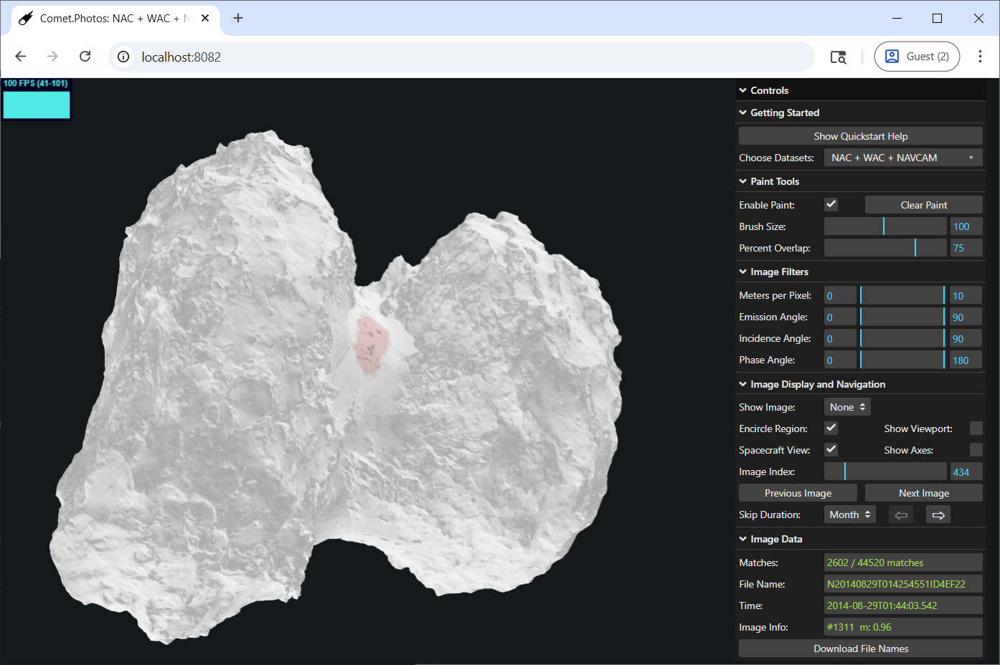
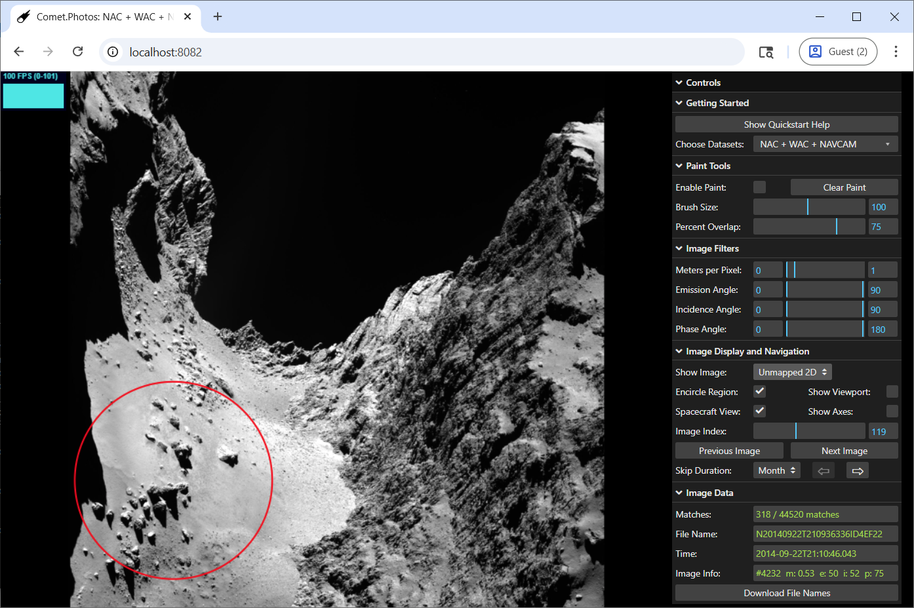
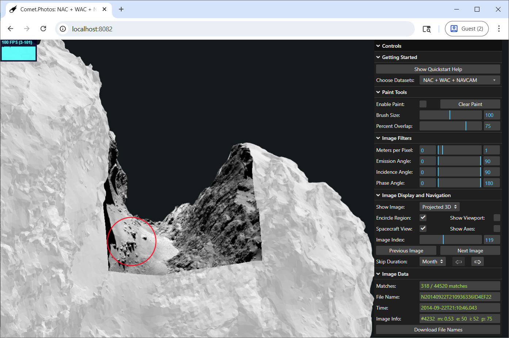

# Summary

The European Space Agency’s Rosetta mission to Comet 67P/Churyumov-Gerasimenko (hereafter, 67P) provided an unparalleled dataset, which has fundamentally reshaped our understanding of comets. Despite these advances, however, the complexity and volume of Rosetta data, coupled with the lack of efficient tools for comprehensive analyses, have hindered its broader utilization. To address this gap, we developed `Comet.Photos`, an interactive tool that enables highly efficient searching, visualizing, and handling of images of irregular bodies.

`Comet.Photos` enables fast, intuitive spatial searches across more than 44,000 images with the highest level of surface detail of 67P, acquired by the Rosetta Optical, Spectroscopic, and Infrared Remote Imaging System (OSIRIS) Narrow Angle Camera (NAC) and Wide Angle Camera (WAC) [@keller2007] and the Navigation Camera (NavCam) [@geiger2021]. Users can define a region of interest on a 3D model of the comet [@preusker2017shape] by painting with a virtual brush (Figure 1). The application then nearly instantly (< 50 ms in this example) returns a time-ordered list of all images containing that region. Results can be further filtered by pixel scale and viewing geometry (emission, incidence, and phase angle), and displayed either in their original 2D form (Figure 2) or projected onto the 3D shape model (Figure 3).

Designed for both professional researchers and the public, `Comet.Photos` can be installed locally for fastest performance, but is also accessible in any modern browser without requiring installation. It combines preprocessed data with real-time, client-side filtering to achieve subsecond search speeds, even across large datasets.

# Statement of need

The European Space Agency’s (ESA) Rosetta mission to 67P provided the most spatially and temporally comprehensive dataset of any comet to date, enabling a broad range of analyses across its surface. Because each region was imaged multiple times under varying illumination and viewing conditions, studies such as photometric modeling [@oklay2016; @fornasier2023], multi-image photoclinometry [@jindal2024], and surface-change detection [@barrington2023; @jindal2022; @birch2019; @elmaary2017; @fornasier2017; @keller2017; @groussin2015] became possible for the first time, substantially advancing our understanding of cometary surface evolution. The sheer number of images, however, makes identifying repeat observations of the same regions a difficult and time-consuming task. This challenge is further compounded by 67P’s complex, highly non-spherical shape and Rosetta’s variable orbit, which often caused images of the same region to appear dramatically different from one another.  

The scale of this difficulty is illustrated by the fact that it took seven years after the end of the Rosetta mission for the first global catalog of surface changes on 67P to be published [@barrington2023]. Compiling this catalog required manually inspecting more than 20,000 OSIRIS NAC images to identify those showing morphological changes---a monumental task that took over a year to complete! This was followed by an additional year for detailed characterization, involving manual map projection of each image with the shapeViewer software [@vincent2018shapeviewer] and then mapping changes in ESRI’s ArcGIS software. Given the wide range of imaging geometries, errors in co-registration and change detection were unavoidable. Consequently, despite these efforts, the global change catalog---and, by extension, our understanding of 67P’s evolution---knowingly remains incomplete, with numerous consequential surface changes still undocumented [@moser2025].

Efforts have been made to mitigate these challenges---for example, ESA has introduced an image search capability within their Planetary Science Archive (PSA) [@esa2024psa]. This tool, however, remains inadequate (at least for Rosetta), as it (a) is slow, (b) frequently returns incorrect or missing data, and (c) lacks user control over filtering searches by image parameters, a crucial feature for assembling a manageable dataset without wasting time removing irrelevant images. Hence, to fully harness the scientific potential of Rosetta’s vast dataset and empower researchers to quickly and accurately identify relevant observations for analysis, an efficient and intuitive tool is needed to streamline image retrieval.  

`Comet.Photos` has been developed to fill this critical gap, providing a powerful solution for rapid, spatially targeted image searches and facilitating detailed studies of cometary surface properties and evolution. Users can select a region of interest by interactively painting the desired region on a 3D model of 67P. In a fraction of a second, the application searches through over 44,000 NAC, WAC, and NavCam images to identify all observations of the selected region. Results can then be filtered by key parameters such as pixel scale, emission angle, incidence angle, and phase angle, allowing users to tailor datasets for photometric or temporal analyses. Images matching the search criteria can be viewed in 2D or projected onto the 3D shape model, and users can export a list of matching image IDs for further processing with external tools.

Although designed primarily for researchers, `Comet.Photos` also provides an accessible interface for educators, students, and the general public to explore Rosetta’s imagery of 67P. By making this tool highly efficient, freely available and simple-to-use, we aim to broaden participation in cometary research and facilitate new scientific insights from this unprecedented dataset. The application runs directly in any modern browser without installation, or can be installed locally for maximum performance (recommended for frequent users). `Comet.Photos` is freely accessible at [https://comet.photos](https://comet.photos).

# Notes on the implementation

`Comet.Photos` achieves its speed through extensive preprocessing of image metadata. For each image, the preprocessing pipeline first simulates the spacecraft camera view and its relative position with respect to the comet's 3D shape model. This determines which model vertices are visible in the simulated scene. The visible vertices are stored in a lookup table that enables, at runtime, fast bitwise operations to compute the fraction of the region of interest (painted vertices) visible in any image. Additional precomputed metadata---such as spacecraft position, solar geometry, and image resolution---allow rapid filtering by geometric or photometric criteria with minimal computation overhead.

To support both high-performance local execution and remote web access, `Comet.Photos` adopts a client-server architecture. The client is organized into object-based modules (Filter Engine, 3D Scene Manager, Image Browser, GUI Controller, etc.) that communicate through an event-driven system. The user interface is specified via a declarative schema, fully decoupled from the controller (Filter Engine) and data model. This event-driven runtime architecture provides the basis for a logging system with automated regression testing. The server component is a small, modular Node.js application with components for launching the browser when run locally, loading the platform-specific C library for rapid visibility checks, and distinct modules that separate preprocessing and runtime event handling. The datasets are separate from the code, and are loaded dynamically given a dataset catalog. 

We are currently using `Comet.Photos` as part of a broader toolset [@jindal2025] to discover and map new surface changes on 67P using Rosetta data. With the appropriate preprocessing, the same framework could support other Rosetta instruments,  such as VIRTIS [@coradini2007], MIRO [@gulkis2007], and ALICE [@stern2007]; it could also be adapted to other small-body missions, including Lucy [@levison2021], Hera [@michel2022], OSIRIS-REx [@lauretta2017], OSIRIS-APEX [@dellagiustina2023], and Hayabusa2 [@watanabe2017].

The `Comet.Photos` GitHub repository [@kurlander2025github] provides the full source code, a detailed [user manual](https://github.com/comet-dot-photos/comet-dot-photos#user-manual), [an example workflow](https://github.com/comet-dot-photos/comet-dot-photos#step-by-step-example), [local installation](https://github.com/comet-dot-photos/comet-dot-photos#installation) and [testing instructions](https://github.com/comet-dot-photos/comet-dot-photos#testing-the-installation), and  documentation on [design, architecture, implementation](https://github.com/comet-dot-photos/comet-dot-photos#design-architecture-and-implementation), and [performance](https://github.com/comet-dot-photos/comet-dot-photos#performance).

# Acknowledgements

This research was supported by the NASA Discovery Data Analysis Program (grant 80NSSC22K1399 supported D.A.K., J.M.S., and J.K.S., and grant 80NSSC24K0060 supported A.S.J. and S.P.D.B.). We gratefully acknowledge Jean-Baptiste Vincent, discussions with whom made this software possible as he helped us navigate Rosetta’s dataset. A 2023 MIT Open Data Prize for an earlier version of this work also provided recognition and encouragement to continue developing `Comet.Photos` [@fay2023opendata]. Lastly, we thank all of the early users of the program for feedback that led to improvements.

 

# References